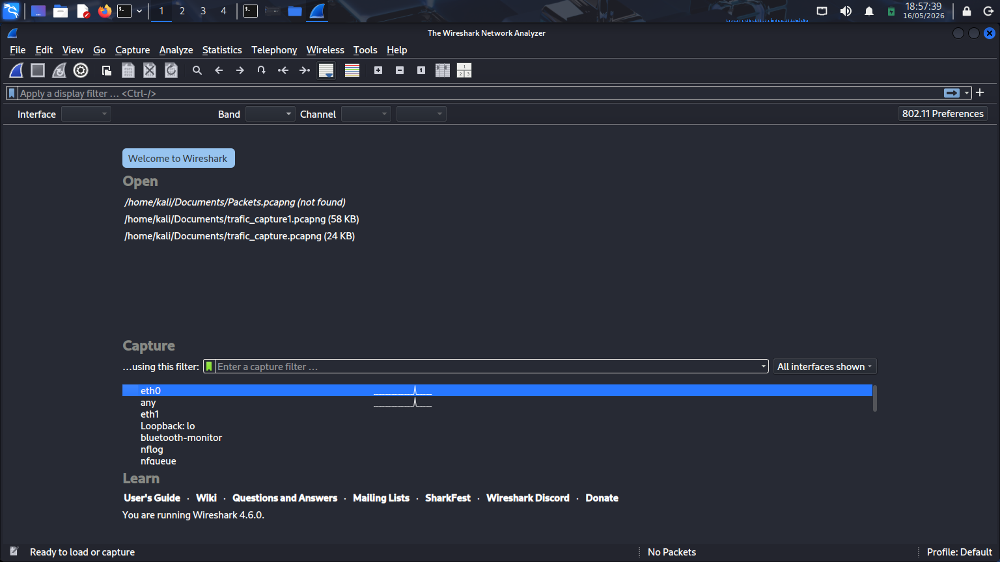
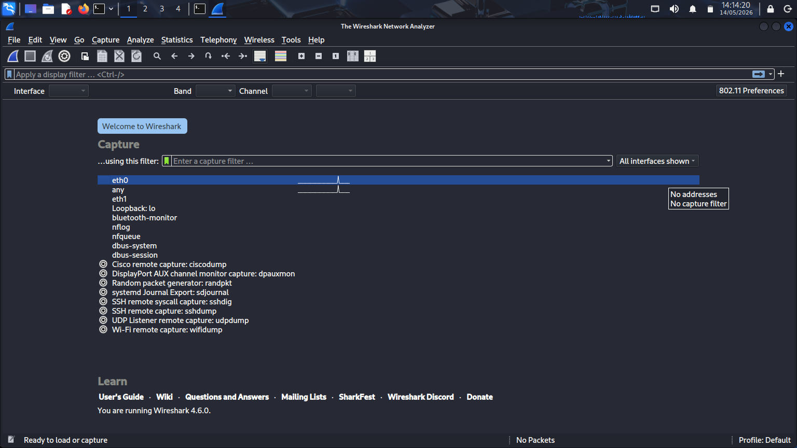

# Wireshark Traffic Analysis Lab

### Network Traffic Investigation and Protocol Analysis using Wireshark

---

## 1. Overview

This project focuses on practical network traffic analysis
and packet-level investigation using Wireshark
within a controlled cybersecurity lab environment.

The investigation simulates real-world SOC workflows
used by analysts to inspect network traffic,
analyze protocols, identify suspicious activity,
and investigate communication behavior.

The lab environment was designed to generate realistic
DNS, HTTP, and TCP traffic for protocol analysis
and threat hunting activities.

This project provides visibility into:

- Network communication patterns
- DNS request behavior
- HTTP web traffic
- TCP session analysis
- Packet-level investigations
- Threat hunting workflows

---

## 2. Investigation Objectives

The primary objectives of this project include:

- Capture live network traffic
- Analyze DNS requests and responses
- Inspect HTTP communication
- Investigate TCP sessions
- Follow TCP streams
- Identify visited websites
- Analyze downloads and communication behavior
- Detect suspicious domains
- Develop practical packet analysis skills
- Document investigation findings professionally

---

## 3. Lab Environment

| Component | Purpose |
|---|---|
| Kali Linux | Traffic generation and investigation |
| Wireshark | Packet capture and protocol analysis |
| Browser Activity | HTTP and DNS traffic generation |
| Linux Networking Utilities | Traffic simulation |

The environment operates within an isolated lab setup
to safely perform packet capture and investigation activities.

---

## 4. Investigation Workflow

The investigation process follows a structured SOC workflow.

1. Generate network traffic
2. Capture packets using Wireshark
3. Apply protocol filters
4. Inspect packet contents
5. Analyze TCP communication streams
6. Identify suspicious activity
7. Document investigation findings

---

## 5. Protocols Analyzed

| Protocol | Purpose |
|---|---|
| DNS | Domain resolution analysis |
| HTTP | Web traffic inspection |
| TCP | Session and stream analysis |

---

## 6. Security Relevance

Network traffic analysis is a critical cybersecurity capability.

Packet analysis helps security teams:

- Investigate suspicious communication
- Detect malicious traffic
- Analyze attacker behavior
- Validate SIEM alerts
- Monitor network visibility
- Investigate downloads and exfiltration activity

Practical packet analysis skills are commonly used by:

- SOC Analysts
- Incident Responders
- Threat Hunters
- Network Security Engineers

---

## 7. Environment Validation

The lab environment was validated to confirm:

- Wireshark installation
- Network interface visibility
- Packet capture capability
- Traffic generation functionality

Successful validation confirms the environment
is ready for packet capture and protocol analysis activities.

---

## 8. Supporting Evidence

### Wireshark Main Interface

The screenshot below shows the Wireshark application
successfully opened inside the Kali Linux environment.

---

### Available Network Interfaces

The following screenshot displays
the available network interfaces
used for packet capture operations.

---

## 9. Investigation Readiness

At this stage, the environment is fully prepared for:

- Live packet capture
- DNS traffic analysis
- HTTP investigation
- TCP stream inspection
- Threat hunting activities

The next phase focuses on generating
and capturing live network traffic for analysis.

---

## 10. Conclusion

This phase establishes the foundation
for practical network traffic investigation
using Wireshark.

The environment is operational
and ready for packet capture
and protocol analysis activities.

---
