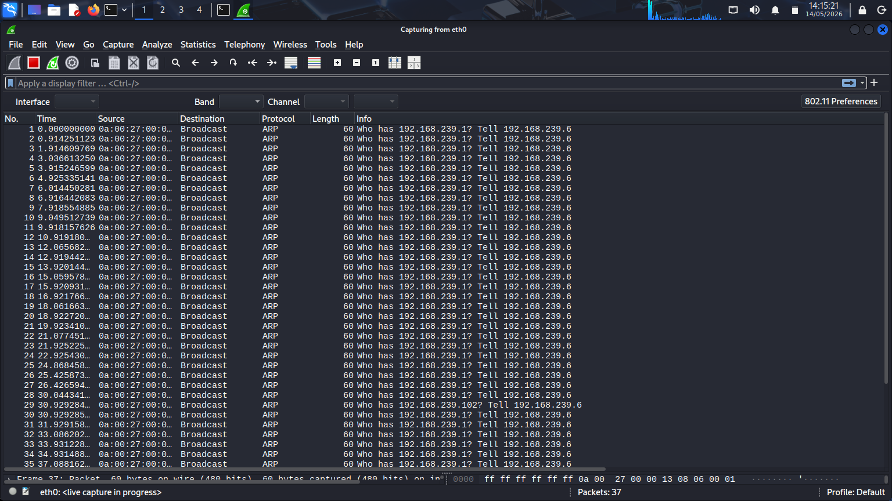
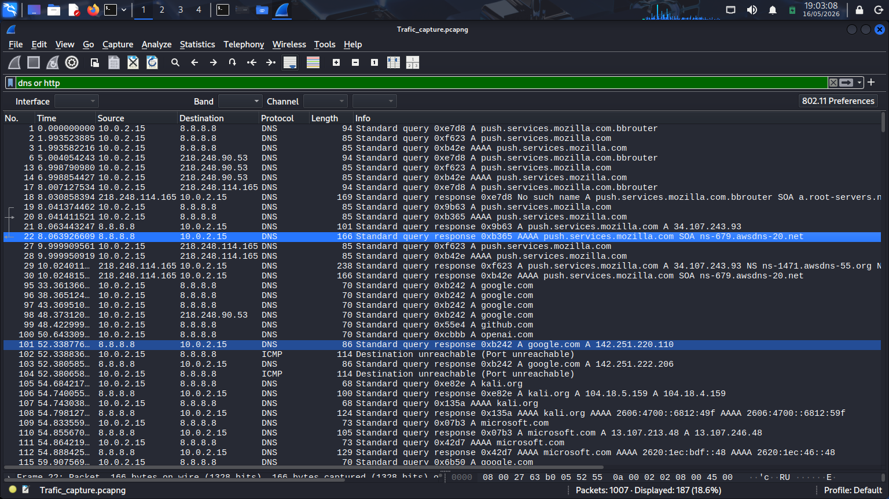
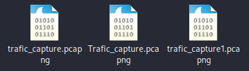

# Packet Capture and Traffic Collection

### Live Network Traffic Acquisition using Wireshark

---

## 1. Overview

This phase focuses on capturing live network traffic
using Wireshark within the lab environment.

The objective is to generate realistic network activity
and collect packet-level data for protocol analysis
and threat hunting investigations.

Packet capture is one of the most important activities
performed by SOC analysts and incident responders
because it provides direct visibility into
network communication behavior.

This phase establishes the foundation
for DNS analysis, HTTP inspection,
TCP stream analysis, and suspicious traffic investigation.

---

## 2. Capture Objectives

The primary objectives of this phase include:

- Capture live DNS traffic
- Capture HTTP communication
- Generate TCP sessions
- Create packet capture evidence
- Validate network visibility
- Prepare traffic for protocol analysis
- Collect investigation data for later phases

---

## 3. Capture Environment

| Component | Purpose |
|---|---|
| Kali Linux | Traffic generation |
| Wireshark | Packet capture |
| Browser Activity | DNS and HTTP traffic |
| Internet Connectivity | Live communication generation |

The traffic was intentionally generated
to create realistic investigation data
for protocol analysis activities.

---

## 4. Capture Methodology

The packet capture process followed
a structured workflow:

1. Select active network interface
2. Start packet capture
3. Generate browsing activity
4. Generate DNS requests
5. Generate HTTP traffic
6. Stop packet capture
7. Save capture file for investigation

This methodology ensures
relevant traffic is successfully collected
for later analysis phases.

---

## 5. Packet Capture Procedure

Wireshark was used to monitor
live network communication
through the active network interface.

Traffic generation included:

- Website browsing
- Domain resolution requests
- HTTP communication
- General TCP connectivity

The generated traffic was captured in real time
for packet-level inspection and investigation.

---

## 6. Traffic Generation Activities

The following activities were performed
to generate investigation traffic:

| Activity | Purpose |
|---|---|
| Web Browsing | Generate HTTP traffic |
| DNS Lookups | Generate DNS packets |
| TCP Connections | Generate session traffic |
| Page Navigation | Create communication streams |

These activities produced sufficient packet data
for protocol analysis and investigation exercises.

---

## 7. Packet Capture File

The captured traffic was exported
as a packet capture file (`.pcap`)
for later investigation and protocol analysis.

Packet capture files are commonly used by:

- SOC teams
- Incident responders
- Malware analysts
- Threat hunters

to investigate suspicious communication behavior.

---

## 8. Supporting Evidence

### Wireshark Live Packet Capture

The screenshot below shows
active packet capture operations
within the Wireshark environment.

---

### Captured DNS and HTTP Traffic

The following screenshot displays
captured DNS and HTTP packets
generated during browsing activity.

---

### Saved Packet Capture File

The screenshot below shows
the exported `.pcap` file
used for later investigation phases.

---

## 9. Security Relevance

Packet capture operations provide
direct visibility into network communication behavior.

Captured traffic can later be used to:

- Investigate suspicious domains
- Analyze attacker communication
- Inspect downloads
- Detect malicious activity
- Investigate network sessions
- Validate security alerts

Packet analysis is a critical capability
within Security Operations Centers.

---

## 10. Findings

The packet capture process successfully collected:

- DNS requests and responses
- HTTP communication
- TCP session traffic
- Website browsing activity

The generated traffic provides sufficient data
for protocol analysis and threat hunting activities.

---

## 11. Conclusion

This phase successfully captured
live network traffic using Wireshark
and generated packet-level investigation data.

The environment is now prepared
for detailed DNS, HTTP,
and TCP protocol analysis.

---
