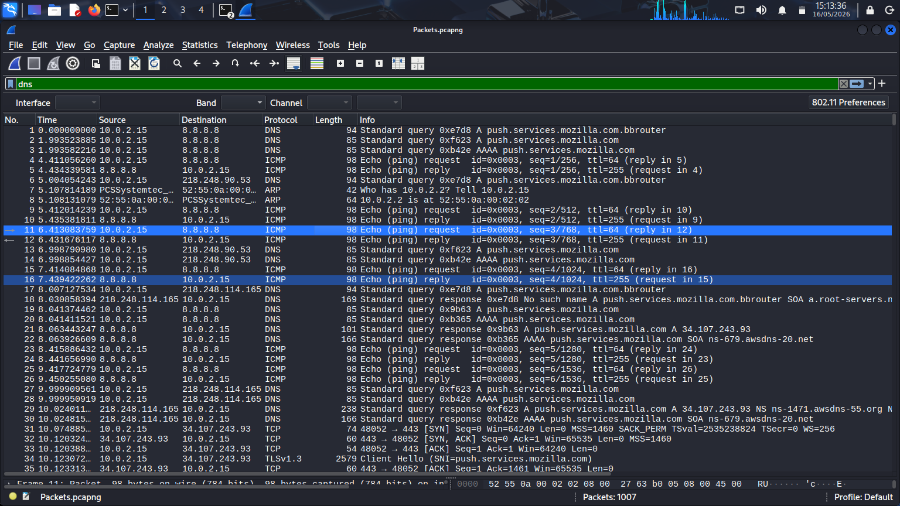
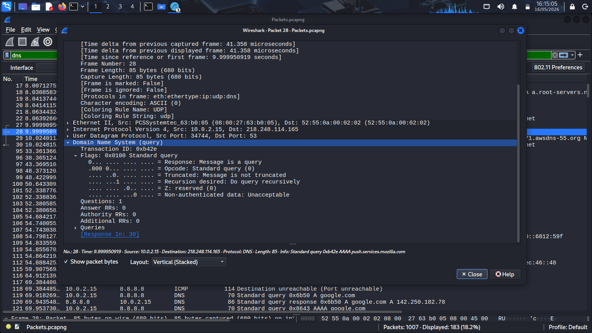
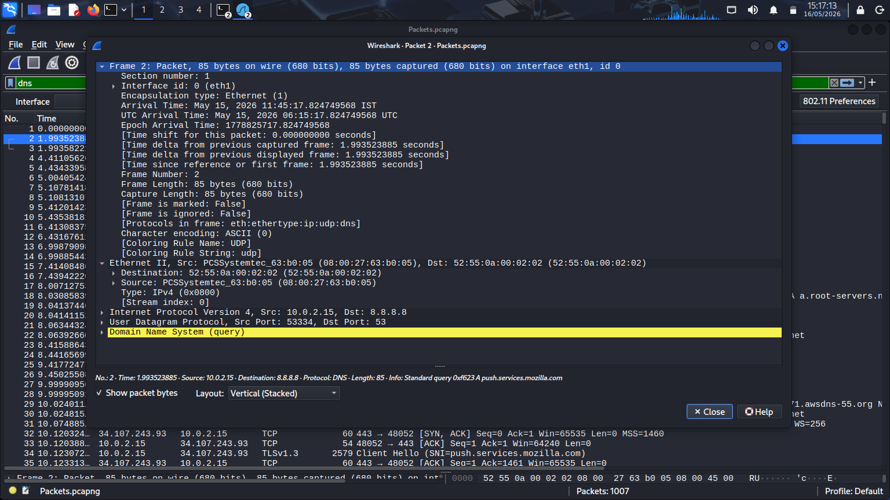

# DNS Traffic Analysis – Wireshark Investigation

### Domain Resolution Analysis and Packet-Level DNS Investigation

---

## 1. Overview

This phase focuses on performing
packet-level DNS traffic analysis
using Wireshark within the lab environment.

DNS (Domain Name System)
is responsible for translating
human-readable domain names
into IP addresses required
for network communication.

Because DNS traffic is frequently abused
by attackers for malicious communication,
phishing infrastructure,
malware beaconing,
and command-and-control activity,
DNS analysis is considered
a critical skill for SOC analysts
and incident responders.

This investigation demonstrates
how packet captures can be analyzed
to identify domain resolution behavior,
external communication,
failed lookups,
and suspicious DNS activity.

---

## 2. Investigation Objectives

The objectives of this phase include:

- Analyze DNS request and response traffic
- Identify queried domains
- Investigate external DNS communication
- Detect failed DNS lookups
- Analyze packet-level DNS behavior
- Inspect recursive query activity
- Develop practical DNS investigation skills

---

## 3. Environment Context

The DNS investigation was performed
using packet captures collected
during live traffic generation activities
inside the isolated cybersecurity lab.

Traffic was generated through:

- Browser-based web requests
- DNS lookup utilities
- External domain communication
- HTTP traffic generation

The investigation used Wireshark
to inspect DNS packet activity
within the captured `.pcap` file.

---

## 4. Investigation Methodology

The investigation followed
a structured DNS analysis workflow.

1. Start packet capture
2. Generate DNS traffic
3. Apply DNS display filter
4. Analyze DNS requests
5. Inspect DNS responses
6. Investigate failed lookups
7. Document investigation findings

This methodology provides visibility
into communication behavior
between endpoints and DNS infrastructure.

---

## 5. Wireshark DNS Filter

The following display filter
was used to isolate DNS traffic.

```text
dns
```

This filter displays:

- DNS requests
- DNS responses
- Domain queries
- Resolution activity
- Recursive DNS traffic
- Failed lookup attempts

---

## 6. Technical Analysis

The packet capture contained
multiple DNS queries and responses
generated through browsing activity
and command-line network utilities.

The investigation identified:

- Successful domain resolution
- Recursive query behavior
- External DNS communication
- Failed lookup attempts
- NXDOMAIN responses

Several external domains
were resolved successfully,
confirming proper DNS communication
within the lab environment.

DNS packets included:

- Standard query requests
- IPv4 resolution responses
- Recursive DNS responses
- Query transaction identifiers

The analysis confirmed
that packet capture functionality
was operating correctly
and successfully recording DNS traffic.

---

## 7. Analyst Observations

During investigation,
multiple DNS requests were observed
between the client endpoint
and external DNS servers.

The traffic pattern demonstrated:

- Normal browsing-related DNS activity
- Repeated domain resolution behavior
- Successful communication with external infrastructure

Intentional failed DNS requests
generated NXDOMAIN responses,
which are commonly investigated
during threat hunting operations.

Repeated failed DNS lookups
may indicate:

- Malware beaconing attempts
- Misconfigured applications
- Suspicious external communication
- Command-and-control resolution failures

The generated packet traffic
provided realistic DNS investigation data
for packet-level analysis.

---

## 8. Findings

The investigation successfully identified:

- DNS request activity
- DNS response traffic
- External domain communication
- Recursive DNS behavior
- Failed DNS lookups
- NXDOMAIN responses

The packet capture provided
clear visibility into DNS communication
within the network environment.

---

## 9. Security Relevance

DNS analysis is heavily used
within Security Operations Centers
and incident response investigations.

Security analysts investigate DNS traffic to:

- Detect malicious domains
- Identify phishing infrastructure
- Investigate malware communication
- Detect command-and-control traffic
- Analyze suspicious external communication
- Investigate abnormal network behavior

DNS visibility provides valuable insight
into endpoint communication patterns.

---

## 10. Supporting Evidence

### DNS Filtered Traffic

The screenshot below demonstrates
DNS packets isolated using
the Wireshark DNS display filter.



---

### DNS Query and Response Analysis

The following screenshot shows
DNS request and response packets
captured during investigation,
including packet details
and resolution activity.



---

### Failed DNS Resolution Activity

The screenshot below displays
failed DNS lookup activity
and NXDOMAIN response behavior
generated during traffic simulation.



---

## 11. Conclusion

This phase successfully demonstrated
practical DNS traffic investigation
using Wireshark packet analysis.

The investigation provided visibility into:

- Domain resolution behavior
- External DNS communication
- Recursive query activity
- Failed lookup attempts
- NXDOMAIN response traffic

The packet capture is now prepared
for HTTP traffic investigation
and TCP stream analysis.
