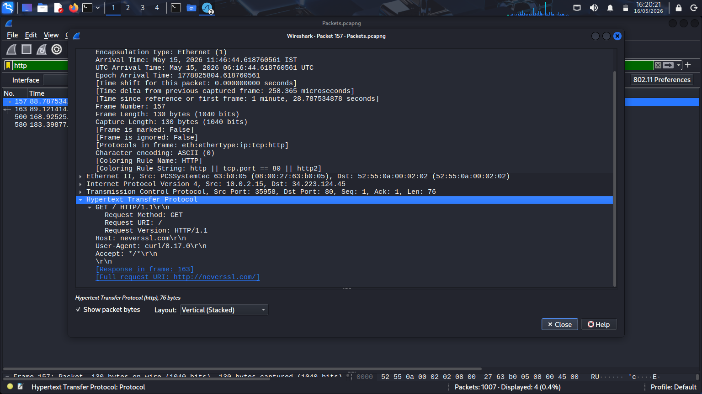
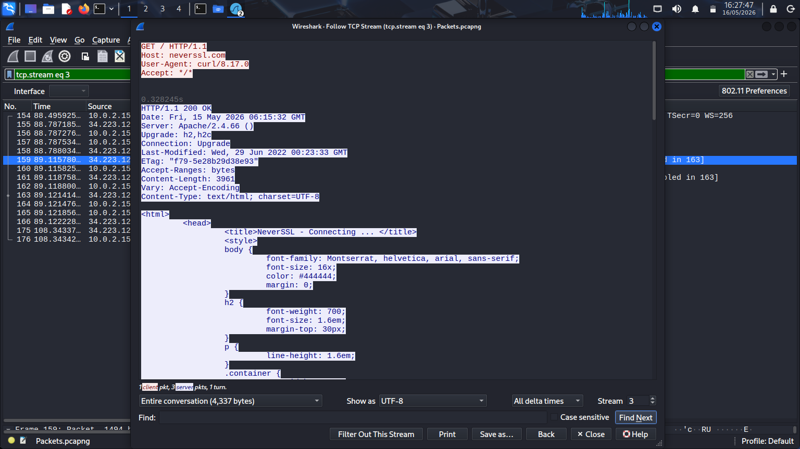

# HTTP Traffic Analysis – Wireshark Investigation

### Web Traffic Inspection and Packet-Level HTTP Analysis

---

## 1. Overview

This phase focuses on performing
packet-level HTTP traffic analysis
using Wireshark within the lab environment.

HTTP (Hypertext Transfer Protocol)
is one of the most commonly used
application-layer protocols
for web communication.

Analyzing HTTP traffic helps
security analysts identify:

- Visited websites
- File downloads
- Suspicious requests
- Malicious communication
- Data exposure
- User browsing activity

This investigation demonstrates
practical web traffic analysis
through packet inspection
and protocol investigation.

---

## 2. Investigation Objectives

The objectives of this phase include:

- Analyze HTTP requests and responses
- Identify visited websites
- Investigate web communication behavior
- Inspect HTTP headers
- Detect file download activity
- Analyze packet-level web traffic
- Develop practical HTTP investigation skills

---

## 3. Environment Context

The HTTP investigation was performed
using packet captures collected
during live traffic generation activities
inside the isolated cybersecurity lab.

Traffic was generated through:

- Browser-based web browsing
- HTTP website access
- File download activity
- External communication testing

Wireshark was used
to inspect captured HTTP packets
inside the `.pcap` file.

---

## 4. Investigation Methodology

The investigation followed
a structured HTTP analysis workflow.

1. Start packet capture
2. Generate HTTP traffic
3. Apply HTTP display filter
4. Analyze HTTP requests
5. Inspect HTTP responses
6. Investigate download activity
7. Document investigation findings

This methodology provides visibility
into web communication behavior
between endpoints and web servers.

---

## 5. Simulation Steps

### Step 1 — Start Packet Capture

Open Wireshark
and begin packet capture
on the active network interface.

---

### Step 2 — Generate HTTP Traffic

Visit the following websites
inside the browser:

```text
http://neverssl.com
http://example.com
http://httpforever.com
```

These websites generate:

- HTTP GET requests
- HTTP responses
- Web communication traffic

---

### Step 3 — Generate Download Activity

Download a small file using terminal:

```bash
curl -O http://example.com
```

This generates:

- HTTP download traffic
- file transfer packets
- HTTP response activity

---

### Step 4 — Stop Packet Capture

After sufficient traffic generation:

1. Return to Wireshark
2. Stop packet capture
3. Save capture file as:

```text
traffic-capture.pcap
```

---

## 6. Wireshark HTTP Filter

The following display filter
was used to isolate HTTP traffic.

```text
http
```

This filter displays:

- HTTP requests
- HTTP responses
- GET requests
- Download activity
- Web communication traffic

---

## 7. Technical Analysis

The packet capture contained
multiple HTTP requests and responses
generated through browser activity
and command-line traffic generation.

The investigation identified:

- HTTP GET requests
- HTTP response packets
- External web communication
- Download-related traffic
- Browser-generated requests

Packet analysis confirmed
successful communication
between the client endpoint
and external web servers.

HTTP packet inspection revealed:

- Requested resources
- Server response behavior
- HTTP status codes
- User-agent information
- Host header values

The generated traffic provided
clear visibility into
application-layer web communication.

---

## 8. Analyst Observations

During investigation,
multiple HTTP requests
were observed between
the client endpoint
and external servers.

The traffic pattern demonstrated:

- Normal browsing behavior
- Repeated web requests
- Successful HTTP communication
- Browser-generated traffic

HTTP traffic analysis can help identify:

- Suspicious downloads
- Malicious payload delivery
- Unauthorized external communication
- Data exfiltration attempts
- Command-and-control traffic

The generated packet traffic
provided realistic web traffic
for packet-level investigation.

---

## 9. Findings

The investigation successfully identified:

- HTTP request activity
- HTTP response traffic
- External web communication
- Download behavior
- Application-layer traffic
- Browser-generated requests

The packet capture provided
clear visibility into
web communication activity
within the lab environment.

---

## 10. Security Relevance

HTTP traffic analysis is heavily used
during incident response,
threat hunting,
and malware investigations.

Security analysts investigate HTTP traffic to:

- Detect malicious downloads
- Investigate suspicious domains
- Analyze user browsing activity
- Detect command-and-control traffic
- Investigate payload delivery
- Identify abnormal communication behavior

Packet-level visibility provides
critical insight into
endpoint web activity.

---

## 11. Supporting Evidence

### HTTP Filtered Traffic

The screenshot below demonstrates
HTTP packets isolated using
the Wireshark HTTP display filter.


---

### HTTP Request and Response Analysis

The following screenshot shows
HTTP request and response packets
captured during investigation.



---

### Download Traffic Investigation

The screenshot below displays
HTTP download-related traffic
generated during simulation.



---

## 12. Conclusion

This phase successfully demonstrated
practical HTTP traffic investigation
using Wireshark packet analysis.

The investigation provided visibility into:

- Web communication behavior
- HTTP request activity
- Download-related traffic
- Application-layer communication
- External server interaction

The packet capture is now prepared
for TCP stream reconstruction
and advanced traffic investigation.