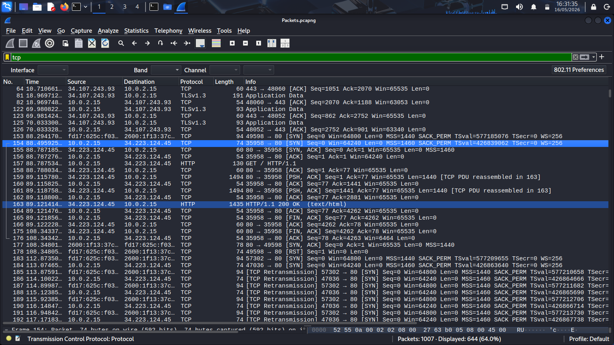
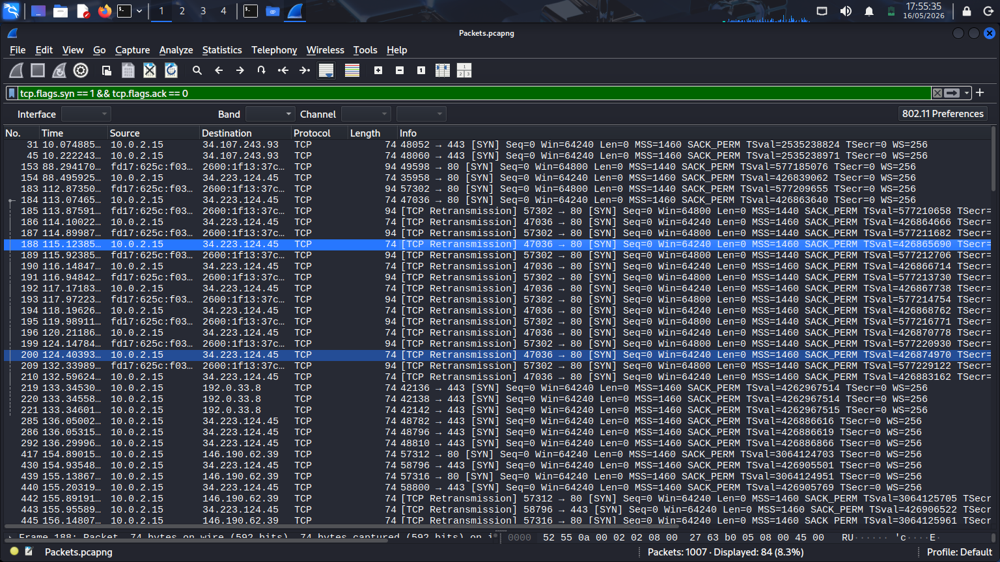

# TCP Stream Analysis – Wireshark Investigation

### Packet Stream Reconstruction and Application-Layer Conversation Analysis

---

## 1. Overview

This phase focuses on performing
TCP stream reconstruction
using Wireshark packet analysis.

TCP stream analysis allows
security analysts to reconstruct
full communication sessions
between endpoints and servers.

This technique is heavily used during:

- Incident response investigations
- Threat hunting operations
- Malware analysis
- Web communication analysis
- Credential theft investigations
- Data exfiltration investigations

This investigation demonstrates
how TCP conversations can be reconstructed
to inspect transmitted data
and analyze communication behavior.

---

## 2. Investigation Objectives

The objectives of this phase include:

- Reconstruct TCP communication streams
- Analyze client-server conversations
- Inspect transmitted application data
- Investigate HTTP session content
- Identify downloaded content
- Develop packet reconstruction skills
- Perform stream-level traffic analysis

---

## 3. Environment Context

The TCP stream investigation
was performed using packet captures
generated during previous DNS
and HTTP traffic simulations.

Traffic was generated through:

- Browser-based web requests
- HTTP communication
- File download activity
- External server interaction

Wireshark was used
to reconstruct communication streams
from captured packet traffic.

---

## 4. Investigation Methodology

The investigation followed
a structured TCP analysis workflow.

1. Open packet capture file
2. Apply TCP display filter
3. Identify active TCP sessions
4. Follow TCP streams
5. Reconstruct communication data
6. Analyze application-layer content
7. Document investigation findings

This methodology provides visibility
into full network conversations
between communicating systems.

---

## 5. Simulation Steps

### Step 1 — Start Packet Capture

Open Wireshark
and begin packet capture
on the active network interface.

---

### Step 2 — Generate Web Traffic

Visit the following websites:

```text
http://neverssl.com
http://example.com
http://httpforever.com
```

This generates:

- TCP sessions
- HTTP communication
- client-server traffic
- application-layer conversations

---

### Step 3 — Generate Download Activity

Run:

```bash
curl -O http://example.com
```

This generates:

- downloadable content traffic
- HTTP transfer sessions
- TCP communication streams

---

### Step 4 — Stop Packet Capture

After sufficient traffic generation:

1. Return to Wireshark
2. Stop packet capture
3. Save capture file as:

```text
traffic-capture.pcap
```

---

## 6. Wireshark TCP Filter

The following display filter
was used to isolate TCP traffic.

```text
tcp
```

This filter displays:

- TCP packets
- active sessions
- stream traffic
- connection activity
- client-server communication

---

## 7. TCP Stream Reconstruction

TCP stream reconstruction
was performed using:

```text
Right Click Packet → Follow → TCP Stream
```

This feature reconstructs
the complete communication session
between systems.

The reconstructed stream displayed:

- HTTP requests
- HTTP responses
- transmitted content
- application-layer data
- server communication

This allowed full inspection
of the transmitted session content.

---

## 8. Technical Analysis

The packet capture contained
multiple TCP sessions
generated through browser communication
and download activity.

The investigation identified:

- Established TCP sessions
- HTTP communication streams
- Application-layer payload data
- Client-server request behavior
- Download-related sessions

TCP reconstruction revealed:

- Full HTTP conversations
- Requested resources
- Server responses
- Communication sequence data
- Session-level interaction behavior

The packet analysis confirmed
successful reconstruction
of application-layer communication.

---

## 9. Analyst Observations

During investigation,
multiple TCP communication sessions
were successfully reconstructed.

The traffic pattern demonstrated:

- Stable client-server communication
- Complete application-layer visibility
- Successful stream reconstruction
- Browser-generated communication behavior

TCP stream reconstruction provides
deep visibility into transmitted data
and communication behavior.

Security analysts frequently use
TCP stream analysis to investigate:

- Malware traffic
- Data exfiltration
- Credential transmission
- Suspicious downloads
- Unauthorized communication
- Command-and-control activity

The generated traffic provided
realistic stream reconstruction data
for investigation purposes.

---

## 10. Findings

The investigation successfully identified:

- Active TCP sessions
- Application-layer communication
- Reconstructed HTTP streams
- Client-server interaction behavior
- Download-related sessions
- Session-level communication data

The packet capture provided
clear visibility into
network conversation behavior
within the lab environment.

---

## 11. Security Relevance

TCP stream reconstruction
is heavily used during
SOC investigations
and incident response operations.

Security teams use stream analysis to:

- Reconstruct attacker communication
- Analyze malware traffic
- Investigate payload delivery
- Detect suspicious sessions
- Inspect transmitted data
- Investigate compromised systems

Application-layer visibility
provides critical insight
into network communication activity.

---

## 12. Supporting Evidence

### TCP Filtered Traffic

The screenshot below demonstrates
TCP packets isolated using
the Wireshark TCP display filter.



---

### TCP Stream Reconstruction

The following screenshot shows
a reconstructed TCP stream
captured during investigation.


---

### Application-Layer Conversation Analysis

The screenshot below displays
application-layer communication data
reconstructed from the TCP session.



---

## 13. Conclusion

This phase successfully demonstrated
practical TCP stream reconstruction
using Wireshark packet analysis.

The investigation provided visibility into:

- TCP communication behavior
- Application-layer conversations
- HTTP stream reconstruction
- Session-level communication
- Client-server interaction behavior

The packet capture is now prepared
for suspicious traffic analysis
and investigation reporting.