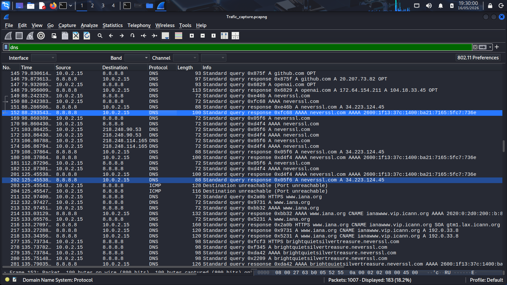
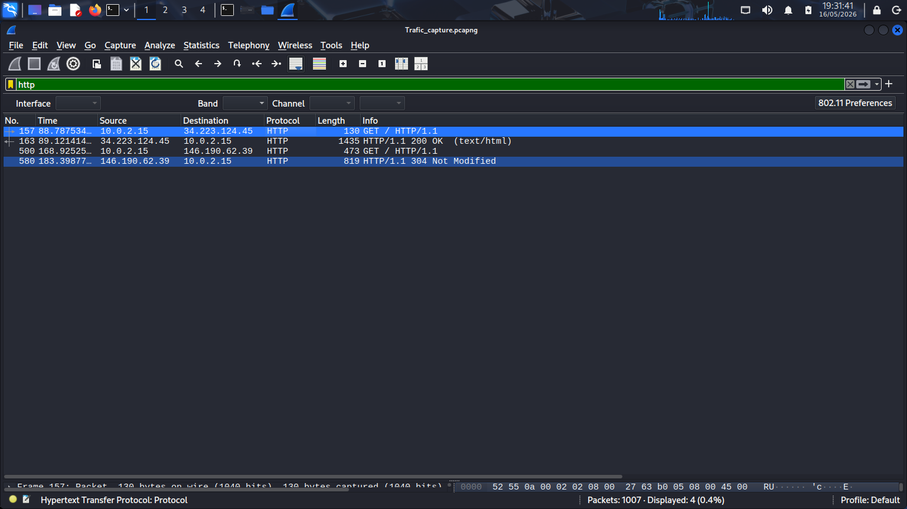
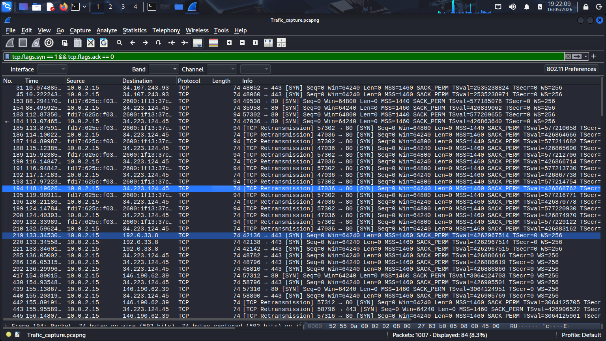
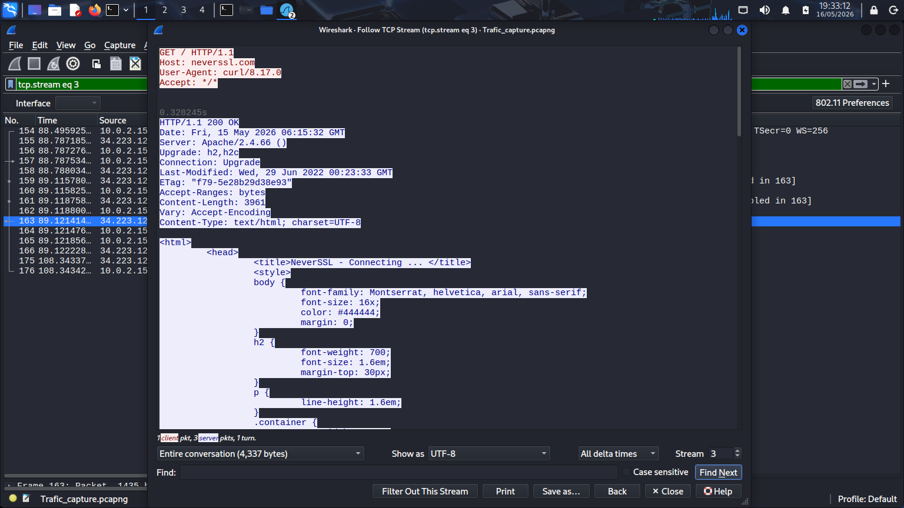

# Suspicious Traffic Investigation – Wireshark Analysis

### Malicious Communication Detection and Network Traffic Investigation

---

## 1. Overview

This phase focuses on investigating
suspicious network traffic
using Wireshark packet analysis.

Suspicious traffic analysis
is a critical component
of Security Operations Center (SOC)
investigations and incident response workflows.

Security analysts investigate
network communication patterns
to identify:

- Malicious domains
- Unauthorized communication
- Suspicious downloads
- Beaconing behavior
- Reconnaissance activity
- Potential malware traffic

This investigation demonstrates
practical traffic analysis techniques
used to identify abnormal
or suspicious network activity.

---

## 2. Investigation Objectives

The objectives of this phase include:

- Investigate suspicious network traffic
- Identify abnormal communication patterns
- Analyze failed DNS lookups
- Inspect unusual HTTP requests
- Investigate external communication
- Detect reconnaissance behavior
- Develop practical threat hunting skills

---

## 3. Environment Context

The investigation was performed
using packet captures collected
during previous traffic generation phases
inside the isolated cybersecurity lab.

Traffic included:

- DNS communication
- HTTP traffic
- TCP sessions
- Download activity
- Simulated suspicious requests

Wireshark was used
to inspect and analyze
captured packet activity.

---

## 4. Investigation Methodology

The investigation followed
a structured threat hunting workflow.

1. Open packet capture file
2. Apply protocol filters
3. Investigate DNS requests
4. Analyze HTTP communication
5. Inspect failed lookups
6. Reconstruct suspicious sessions
7. Document investigation findings

This methodology provides visibility
into suspicious communication behavior
within the network environment.

---

## 5. Simulation Steps

### Step 1 — Start Packet Capture

Open Wireshark
and begin packet capture
on the active network interface.

---

### Step 2 — Generate DNS Traffic

Run:

```bash
nslookup google.com
nslookup github.com
nslookup fake-malicious-domain-test.com
```

This generates:

- Normal DNS activity
- Failed DNS lookups
- NXDOMAIN responses

---

### Step 3 — Generate HTTP Traffic

Visit:

```text
http://neverssl.com
http://example.com
```

This generates:

- HTTP communication
- Browser traffic
- External web requests

---

### Step 4 — Generate Reconnaissance Traffic

Run:

```bash
nmap scanme.nmap.org
```

This generates:

- Reconnaissance traffic
- TCP probing activity
- Scan-related packets

---

### Step 5 — Stop Packet Capture

After sufficient traffic generation:

1. Return to Wireshark
2. Stop packet capture
3. Save capture file as:

```text
traffic-capture.pcap
```

---

## 6. Wireshark Investigation Filters

The following display filters
were used during investigation.

### DNS Traffic

```text
dns
```

---

### HTTP Traffic

```text
http
```

---

### TCP Traffic

```text
tcp
```

---

### Reconnaissance Detection

```text
tcp.flags.syn == 1 && tcp.flags.ack == 0
```

This filter helps identify:

- SYN scan activity
- reconnaissance behavior
- connection probing attempts

---

## 7. Technical Analysis

The packet capture contained
multiple forms of communication
generated through browsing activity,
DNS queries,
and reconnaissance traffic.

The investigation identified:

- External DNS communication
- Failed DNS lookups
- HTTP requests and responses
- TCP connection activity
- SYN scan behavior

Analysis revealed
multiple outbound communication attempts
to external infrastructure.

Failed DNS lookups generated
NXDOMAIN responses,
which are commonly analyzed
during threat hunting operations.

TCP SYN packets generated by Nmap
demonstrated reconnaissance behavior
commonly observed during
network scanning activity.

The generated traffic provided
realistic investigation data
for packet-level analysis.

---

## 8. Analyst Observations

During investigation,
multiple forms of suspicious behavior
were observed within the packet capture.

The traffic pattern demonstrated:

- Repeated DNS communication
- Failed domain resolution attempts
- External HTTP communication
- TCP probing behavior
- Reconnaissance-related traffic

Repeated failed DNS lookups
may indicate:

- Malware beaconing
- Misconfigured applications
- Suspicious communication attempts
- Failed command-and-control resolution

TCP SYN scan behavior
is commonly associated with:

- Port scanning
- Service enumeration
- Attack surface discovery
- Reconnaissance operations

The generated traffic provided
practical investigation data
used during SOC threat hunting workflows.

---

## 9. Findings

The investigation successfully identified:

- DNS request activity
- Failed DNS resolution
- HTTP communication behavior
- TCP session activity
- SYN scan reconnaissance traffic
- External communication attempts

The packet capture provided
clear visibility into
potentially suspicious
network communication behavior.

---

## 10. Security Relevance

Suspicious traffic analysis
is heavily used during:

- Incident response investigations
- Threat hunting operations
- Malware investigations
- SOC monitoring workflows
- Network forensic analysis

Security analysts investigate traffic to:

- Detect malicious communication
- Identify attacker behavior
- Investigate suspicious domains
- Detect reconnaissance activity
- Analyze malware traffic
- Investigate abnormal network behavior

Packet-level visibility
provides valuable insight
into endpoint communication activity.

---

## 11. Supporting Evidence

### DNS Investigation Traffic

The screenshot below demonstrates
DNS packets observed during investigation.



---

### HTTP Communication Analysis

The following screenshot shows
HTTP requests and responses
captured during traffic investigation.



---

### SYN Scan Reconnaissance Activity

The screenshot below displays
TCP SYN packets generated
during reconnaissance simulation.



---

### TCP Stream Investigation

The following screenshot demonstrates
reconstructed TCP communication
used during packet investigation.



---

## 12. Conclusion

This phase successfully demonstrated
practical suspicious traffic investigation
using Wireshark packet analysis.

The investigation provided visibility into:

- DNS communication behavior
- Failed lookup activity
- HTTP traffic analysis
- TCP reconnaissance behavior
- SYN scan activity
- External communication patterns

The packet capture successfully simulated
realistic investigation scenarios
commonly analyzed within
SOC environments and incident response workflows.