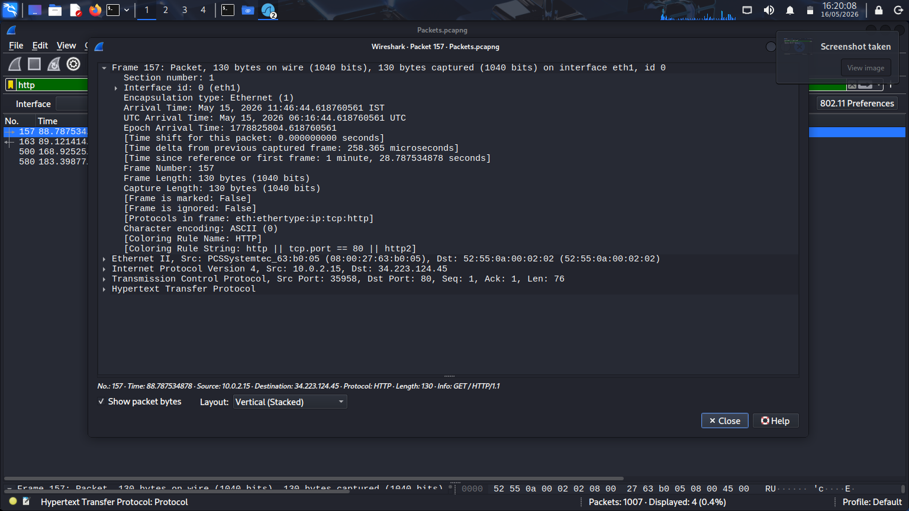
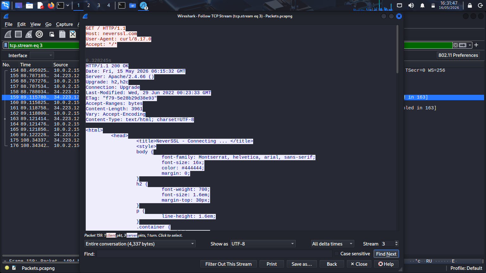

# Investigation Findings – Wireshark Traffic Analysis Lab

### Network Traffic Investigation Summary and Security Analysis

---

## 1. Overview

This phase summarizes
the complete Wireshark investigation
performed throughout the lab environment.

The investigation included:

- DNS traffic analysis
- HTTP traffic investigation
- TCP stream reconstruction
- Suspicious traffic analysis
- Reconnaissance detection
- Packet-level communication analysis

The objective of this summary
is to consolidate investigation findings,
security observations,
and analyst conclusions
identified during packet analysis.

---

## 2. Investigation Scope

The investigation analyzed
network traffic generated
within the isolated cybersecurity lab.

Traffic sources included:

- Browser-generated communication
- DNS lookup activity
- HTTP requests and responses
- Download-related traffic
- TCP communication sessions
- Reconnaissance simulation activity

Packet captures were analyzed
using Wireshark
to investigate communication behavior
and identify suspicious activity.

---

## 3. Investigation Methodology

The investigation followed
a structured SOC-style workflow.

1. Capture live network traffic
2. Apply protocol-specific filters
3. Analyze DNS communication
4. Investigate HTTP requests
5. Reconstruct TCP sessions
6. Detect suspicious traffic patterns
7. Document findings and evidence

This methodology provided
packet-level visibility
into endpoint communication activity.

---

## 4. DNS Investigation Findings

DNS analysis identified:

- External domain communication
- Recursive DNS requests
- DNS response traffic
- Failed DNS lookups
- NXDOMAIN responses

The packet capture confirmed
successful DNS communication
between the endpoint
and external DNS infrastructure.

Failed DNS resolution activity
generated realistic investigation data
commonly analyzed during
threat hunting operations.

---

## 5. HTTP Investigation Findings

HTTP analysis identified:

- Browser-generated requests
- HTTP GET requests
- Server responses
- Download-related communication
- External web traffic

Packet inspection provided visibility into:

- Requested resources
- Response behavior
- Application-layer communication
- User browsing activity

HTTP traffic reconstruction confirmed
successful communication
with external web servers.

---

## 6. TCP Stream Investigation Findings

TCP stream reconstruction identified:

- Active TCP sessions
- Full communication streams
- Application-layer conversations
- Client-server interaction behavior
- Download-related sessions

Stream reconstruction successfully revealed:

- HTTP request data
- HTTP response content
- Session-level communication
- Transmitted application-layer traffic

The investigation demonstrated
practical packet reconstruction techniques
used during SOC investigations.

---

## 7. Suspicious Traffic Findings

Suspicious traffic analysis identified:

- Failed DNS lookups
- SYN scan activity
- Reconnaissance behavior
- External communication attempts
- Abnormal packet patterns

Nmap-generated SYN packets
successfully simulated
real-world reconnaissance behavior
commonly observed during
attack surface discovery operations.

The generated traffic provided
realistic threat hunting data
for packet-level investigation.

---

## 8. Analyst Observations

The investigation demonstrated
clear visibility into:

- DNS communication behavior
- Web communication activity
- TCP session reconstruction
- Reconnaissance traffic patterns
- Application-layer interaction

Repeated failed DNS lookups
generated NXDOMAIN responses
commonly investigated during:

- Malware analysis
- Beaconing investigations
- Threat hunting operations

SYN scan behavior demonstrated
reconnaissance techniques
used during:

- Port scanning
- Service enumeration
- Attack surface mapping

The investigation successfully simulated
realistic SOC investigation scenarios.

---

## 9. Security Relevance

Packet-level traffic analysis
is critical for:

- Incident response
- Threat hunting
- Malware analysis
- Intrusion investigations
- Network forensic analysis
- SOC monitoring operations

Security analysts rely on
network traffic visibility
to identify malicious behavior,
investigate suspicious communication,
and detect unauthorized activity.

Wireshark provides deep visibility
into network communication patterns
and application-layer traffic.

---

## 10. Overall Findings Summary

The investigation successfully identified:

- DNS request activity
- HTTP communication behavior
- TCP session reconstruction
- Download-related traffic
- SYN scan reconnaissance activity
- External communication attempts
- Failed DNS resolution activity

The packet captures provided
realistic investigation data
commonly analyzed within
SOC environments
and incident response workflows.

---

## 11. Supporting Evidence

### DNS Investigation Evidence

---

### HTTP Investigation Evidence

---

### TCP Stream Reconstruction Evidence

---

### Reconnaissance Detection Evidence

---

## 12. Conclusion

This project successfully demonstrated
practical packet-level investigation
using Wireshark traffic analysis.

The investigation included:

- DNS traffic analysis
- HTTP communication inspection
- TCP stream reconstruction
- Suspicious traffic investigation
- Reconnaissance detection

The workflow simulated
real-world SOC investigation techniques
used during:

- Threat hunting
- Incident response
- Malware investigations
- Network forensic analysis

The project demonstrates
practical understanding of:

- Packet analysis
- Traffic investigation
- Network communication behavior
- Protocol analysis
- Security monitoring workflows

This lab provides a strong foundation
for advanced SOC analysis
and network forensic investigations.